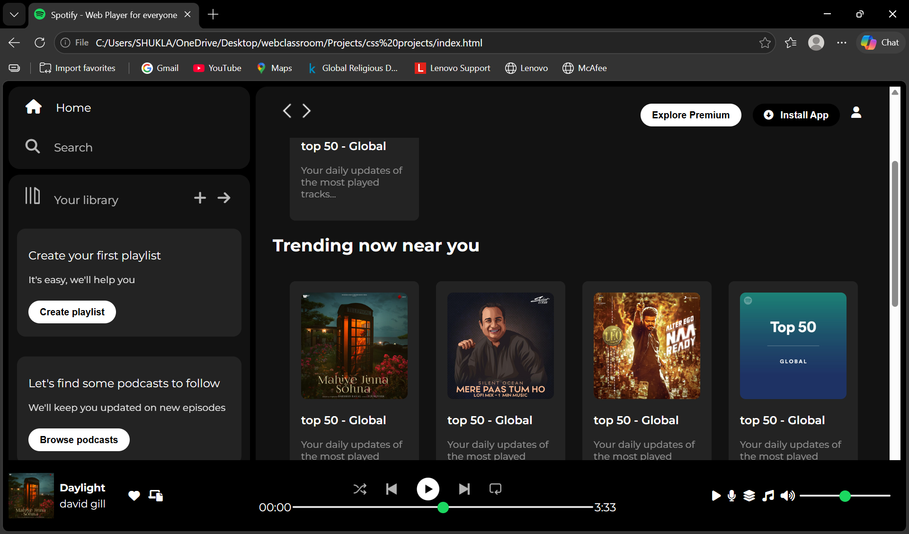

# Spotify Web Player Clone 🎵

A responsive Spotify Web Player Clone built using HTML and CSS.

## Preview



## Features

- Responsive Spotify-inspired UI
- Sidebar Navigation Menu
- Library Section
- Playlist & Podcast Cards
- Sticky Navigation Bar
- Music Player Controls
- Volume and Progress Sliders
- Modern Dark Theme
- Font Awesome Icons

## Technologies Used

- HTML5
- CSS3
- Font Awesome
- Google Fonts (Montserrat)

## Project Structure

```
spotify-web-player-clone/
│
├── index.html
├── style.css
├── screenshot.png
├── logo.png
├── library_icon.png
├── backward_icon.png
├── forward_icon.png
├── player_icon1.png
├── player_icon2.png
├── player_icon3.png
├── player_icon4.png
├── player_icon5.png
└── assets/
```

## How to Run

1. Clone the repository

```bash
git clone https://github.com/your-username/spotify-web-player-clone.git
```

2. Open the project folder

3. Open `index.html` in your browser

## Learning Outcomes

- Flexbox Layout
- Responsive Design
- Positioning and Sticky Navigation
- CSS Styling Techniques
- UI Cloning Practice
- Media Queries

## Future Improvements

- Add JavaScript Functionality
- Play/Pause Music Controls
- Dynamic Playlist Rendering
- Dark/Light Theme Toggle
- Mobile Optimization

## Author

Priya Shukla

---

**Note:** This project is created for educational purposes only and is inspired by Spotify's user interface.